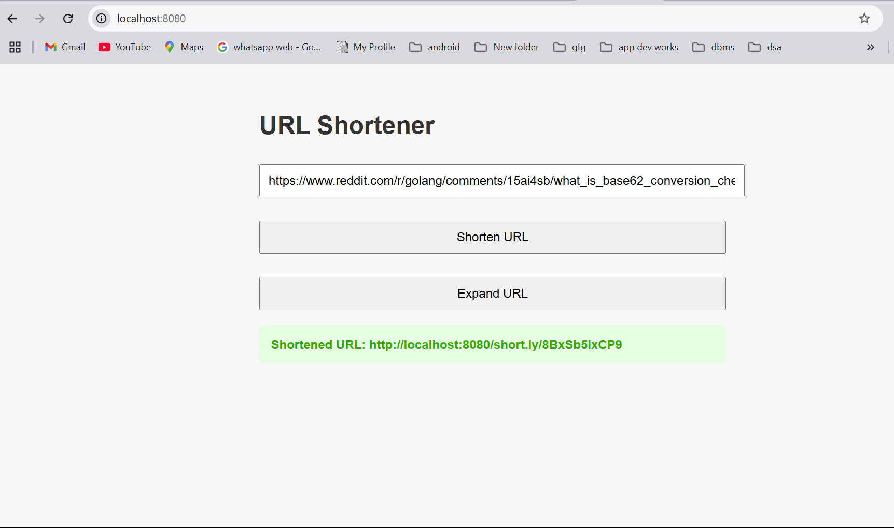
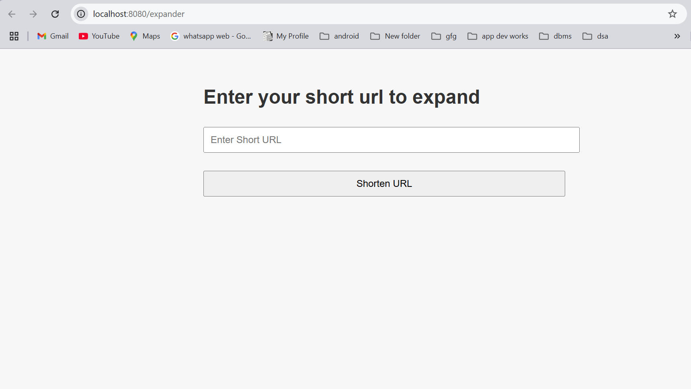

# Url_Shortner
A URL shortener takes a long URL (e.g., https://www.verylongwebsite.com/article/12345) and converts it into a short URL (e.g., https://short.ly/abc123).

**Landing page will look like this**

You will be able to provide the long URL and get the short URL in return. The short URL will be stored in a database, and when a user clicks on it, they will be redirected to the original long URL.

**You can confirm the short url**
Click on the expand button it will open the new tab 
 
Provide the short URL and click on the expand button it will open the long URL.

**finally**
If you open the short url in the new tab that will open the actual long URL.
and land you to the actual page.

Hope this Helps 

**Note**
If you want to use the source code in your Project

Step 1: Clone the repository

Step 2: Install the required packages

Step 3: Provide your local credentials in the DatabaseConnection.java file

Step 4: Run the HttpApi.java file